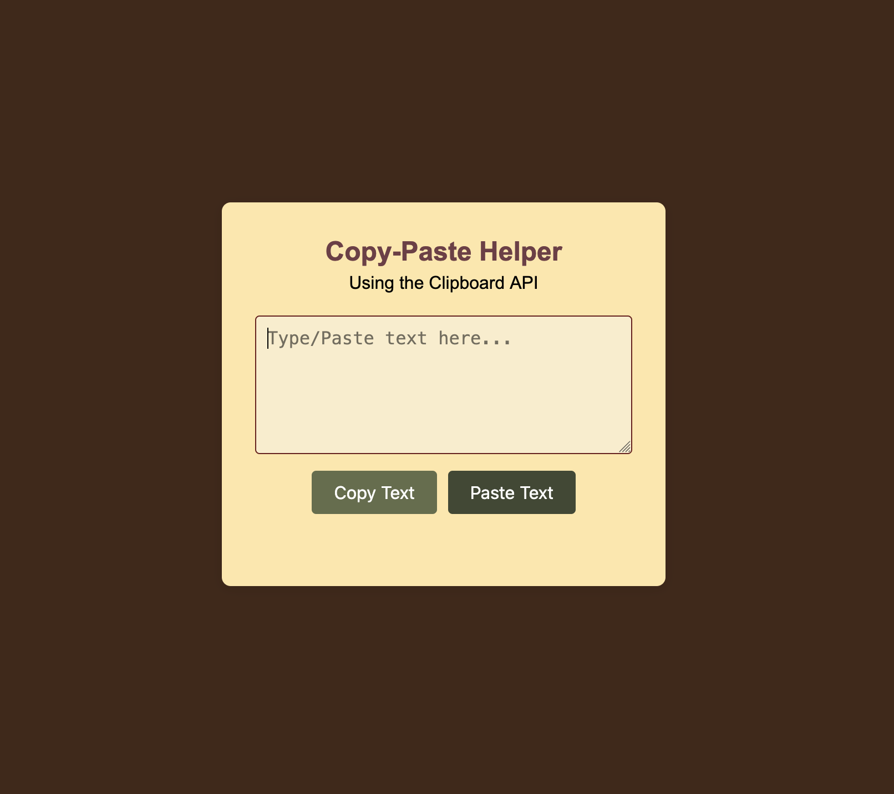

# Copy-Paste Helper

[Website](https://abhineetbiju-scaler.github.io/term2-copy-paste-helper/)

A simple web application that demonstrates the **Clipboard API** for copying and pasting text.

## Features

- **Copy Text** — Copies textarea content to clipboard
- **Paste Text** — Pastes clipboard content into textarea
- Status messages with auto-hide
- Error handling for blocked clipboard operations

## Screenshot

## Tech Stack

- HTML, CSS, JavaScript
- Clipboard API (`navigator.clipboard`)
